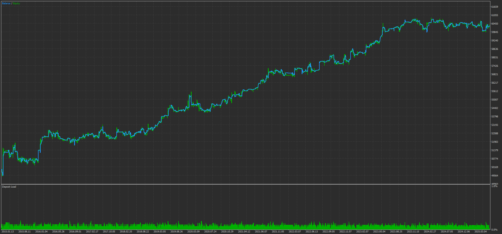
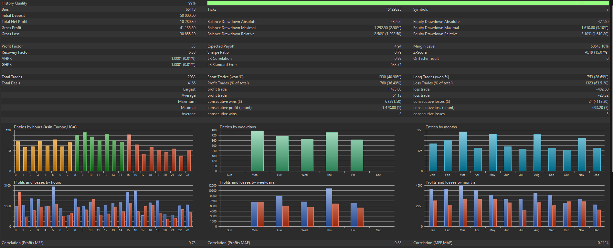
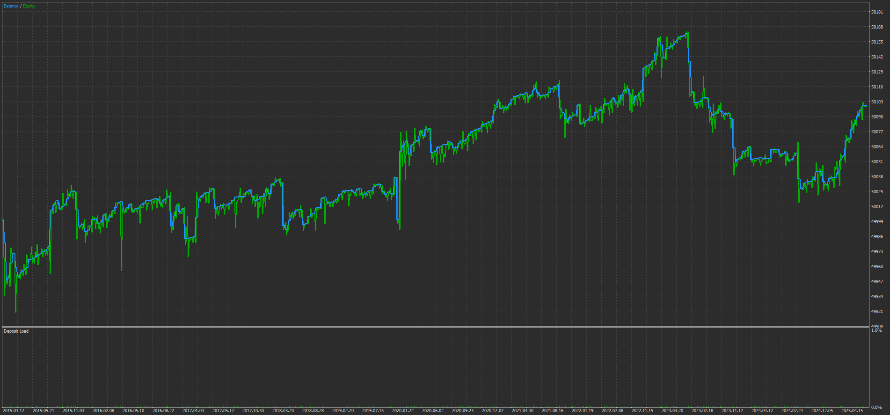

# Multi-Layer Perceptron Statistical Arbitrage

This repository demonstrates how neural networks can be used inside MetaTrader 5 to enhance a traditional correlation based statistical arbitrage strategy. The project includes two expert advisors:

* **MLP_Stat_Arb.mq5** – a multi‑layer perceptron (MLP) approach that scans every major currency pair combination and scores potential trades.
* **EA_Correlation.mq5** – a simple Pearson/Spearman correlation strategy that operates on a fixed symbol pair defined by the `SecSymbol` input.

The MLP EA shows how to embed and parameterise a neural network directly in MQL5. The weights included in `experts/MLP_Stat_Arb.mq5` are **placeholders only**. The performance graphs in `images/` were generated using a fully trained network that was forward and genetically optimised to reduce overfitting. The weights shown in the file with in the repository does *not* have trained weights.

While it is **technically possible** to deploy deeper, more exotic architectures (CNNs, LSTMs, Transformers) inside MQL5, doing so is *far from trivial*—you’ll wrestle with limited BLAS support, memory constraints per symbol, and the absence of unified tensor libraries.  

That’s why a *lean, fully-connected MLP*—like the one illustrated here—often delivers a **surprisingly effective** accuracy/complexity trade-off for statistical-arbitrage tasks, compiling instantly and running in-terminal with minimal overhead.


## Repository Layout

```
experts/    MQL5 source files for both strategies
images/     Back‑test results
```

### Back‑test Results




![Correlation Data]


The MLP approach trades all major currency crosses and therefore captures far more opportunities than the benchmark EA, which only trades a single predefined pair. In historical tests this resulted in larger net profits and more robust behaviour across different market regimes.

## Compiling

Open the `.mq5` files in MetaEditor and press **Compile**. The MLP EA requires no additional DLLs – the neural network is implemented entirely in MQL5.

## Future Work

Planned features include:

- fixed exposure and spread leg risk management
- beta‑neutral portfolio constraints
- support for additional asset classes

